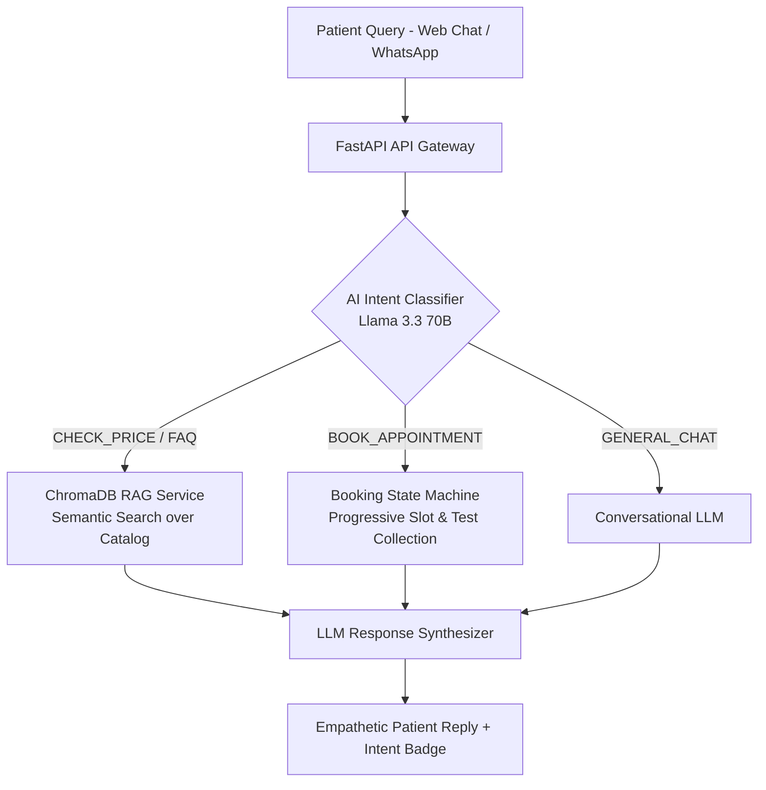

# 🏥 LabAssist AI — Autonomous Diagnostic Laboratory Front Desk

> A pilot-ready conversational AI assistant for diagnostic laboratories featuring grounded test information, a persistent confirmation-first booking workflow, and multilingual response support.

---

## 🏛️ System Architecture



---

## 🚀 Key Engineering Capabilities

1. **Semantic RAG Pipeline (ChromaDB + Cosine Similarity)**
   - Indexes 50+ laboratory blood/urine tests, pricing, turnaround times, and fasting rules.
   - Eliminates LLM hallucination on medical test prices and preparation instructions.

2. **Deterministic Intent Classification & Booking Workflow**
   - Classifies user messages into 5 workflows (`BOOK_APPOINTMENT`, `CHECK_PRICE_OR_INFO`, `FAQ_OR_POLICY`, `CANCEL_RESCHEDULE`, `GENERAL_CHAT`).
   - Combines LLM flexibility with strict Python state machines (`BookingState`) to collect required appointment fields without guesswork.

3. **Multilingual Processing & Localization**
   - Built to handle English, Hindi, and Bengali queries for diverse urban medical center demographics.

4. **Containerized Production Setup**
    - Fully dockerized with persistent ChromaDB volume mounts and clean REST API boundaries.

5. **Persistent appointment operations**
   - SQLite-backed lab profile, slot capacity, booking sessions, confirmed appointments, and staff cancellation APIs.
   - A booking is only created after the patient explicitly replies with a confirmation.

---

## 🛠️ Tech Stack

| Component | Technologies Used |
|---|---|
| **Backend Framework** | Python 3.10, FastAPI, Uvicorn, Pydantic v2 |
| **LLM & Inference** | Groq API (`llama-3.3-70b-versatile`), Structured JSON outputs |
| **Vector Database & Embeddings** | ChromaDB, Sentence-Transformers (`all-MiniLM-L6-v2`), ONNX Runtime |
| **Frontend UI** | Modern Vanilla HTML5/CSS3 Glassmorphism UI, Responsive Chat Widget |
| **DevOps & Infrastructure** | Docker, Docker Compose, Git |

---

## ⚡ Quick Start (Run Locally in 60 Seconds)

### 1. Clone & Set Up Environment
```bash
git clone https://github.com/pandeymic/labassist-ai.git
cd labassist-ai
python3 -m venv venv
source venv/bin/activate
pip install -r requirements.txt
```

### 2. Configure Environment Variable
Add your Groq API key to `~/.env` or export it:
```bash
export GROQ_API_KEY="gsk_your_api_key_here"
export LABASSIST_ADMIN_KEY="choose-a-long-random-value"
export PUBLIC_BASE_URL="https://your-public-domain.example.com"
```

### 3. Start the FastAPI Server
```bash
uvicorn backend.main:app --reload --port 8000
```
*The server will automatically index `data/test_catalog.json` and `data/faqs.json` into ChromaDB on first launch.*

### 4. Open the Web Chat Interface
Simply open `frontend/index.html` in your web browser, or serve it:
```bash
open frontend/index.html
```

---

## 📡 API Documentation

| Method | Endpoint | Description |
|---|---|---|
| `GET` | `/api/health` | Service health and LLM connection verification |
| `GET` | `/api/tests` | Returns JSON catalog of all available laboratory tests |
| `POST` | `/api/chat` | Main conversational endpoint with RAG + Intent Routing |
| `GET` | `/api/lab/profile` | Public lab identity for the web widget |
| `GET` | `/api/slots?appointment_date=YYYY-MM-DD` | Available booking slots |
| `POST` | `/api/admin/slots` | Create a slot; requires `X-Admin-Key` |
| `GET` | `/api/admin/appointments` | List appointments; requires `X-Admin-Key` |
| `POST` | `/api/admin/appointments/{id}/cancel` | Cancel appointment; requires `X-Admin-Key` |
| `POST` | `/api/webhook/voice` | Twilio-compatible voice call entrypoint |
| `POST` | `/api/webhook/voice/respond` | Twilio speech transcript → shared LabAssist workflow |
| `POST` | `/api/live/token` | Short-lived Gemini Live browser-session token |

### Phone voice pilot

The voice endpoints use Twilio's speech gathering only as the telephony adapter. LabAssist still owns the intent routing, RAG answers, slot validation, confirmation, and booking. Set `PUBLIC_BASE_URL` to the public HTTPS URL of the deployment, then configure the Twilio number's incoming voice webhook as:

```text
POST https://your-public-domain.example.com/api/webhook/voice
```

This is the first phone slice. Before a paid pilot, add Twilio signature validation, call recording/transcript retention controls, a human-transfer number, and a production voice provider configuration.

### Gemini Live voice widget

Set `GEMINI_API_KEY` only on the backend. The browser requests a single-use, short-lived token from `/api/live/token`; the long-lived API key is never sent to the browser. Gemini Live is currently a preview API, so keep the browser speech fallback enabled.

### Pilot setup

Before accepting a booking, create the real slots that a lab is willing to serve:

```bash
curl -X POST http://localhost:8000/api/admin/slots \
  -H "Content-Type: application/json" \
  -H "X-Admin-Key: $LABASSIST_ADMIN_KEY" \
  -d '{"appointment_date":"2026-08-01","start_time":"08:00","end_time":"09:00","capacity":3}'
```

Set `ALLOWED_ORIGINS` to the explicit domains allowed to host the web widget. Do not use a wildcard origin for a patient-facing deployment.

### Sample `/api/chat` Request
```json
{
  "session_id": "user-102",
  "message": "How much is a lipid profile and do I need to fast?",
  "language": "English"
}
```

### Sample `/api/chat` Response
```json
{
  "session_id": "user-102",
  "reply": "A full Lipid Profile costs ₹850 INR. Yes, fasting is required for 10 hours before sample collection so we can accurately measure your triglycerides and cholesterol.",
  "intent": "CHECK_PRICE_OR_INFO",
  "confidence": "high",
  "retrieved_context_used": true
}
```

---

## 📄 License
MIT License — Developed by [Vineet Pandey](https://github.com/pandeymic).
