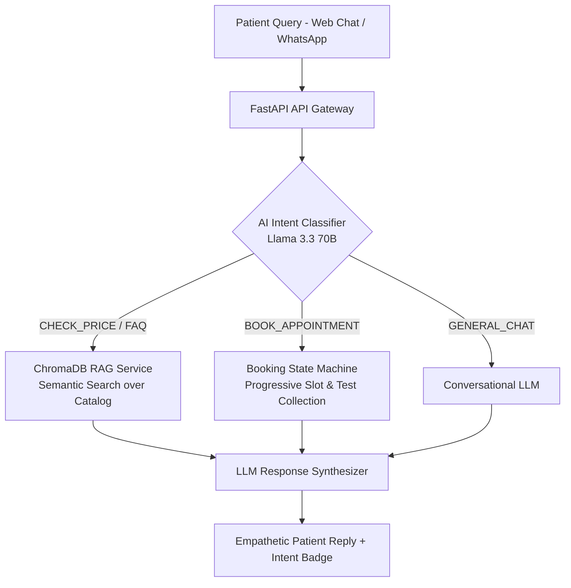

# 🏥 LabAssist AI — Autonomous Diagnostic Laboratory Front Desk

> **Production-grade conversational AI assistant for diagnostic laboratories** featuring semantic RAG over medical test catalogs, multi-turn appointment booking state machines, and multilingual support.

---

## 🏛️ System Architecture



---

## 🚀 Key Engineering Capabilities

1. **Semantic RAG Pipeline (ChromaDB + Cosine Similarity)**
   - Indexes 50+ laboratory blood/urine tests, pricing, turnaround times, and fasting rules.
   - Eliminates LLM hallucination on medical test prices and preparation instructions.

2. **Deterministic Intent Classification & Booking Workflow**
   - Classifies user messages into 5 workflows (`BOOK_APPOINTMENT`, `CHECK_PRICE_OR_INFO`, `FAQ_OR_POLICY`, `CANCEL_RESCHEDULE`, `GENERAL_CHAT`).
   - Combines LLM flexibility with strict Python state machines (`BookingState`) to collect required appointment fields without guesswork.

3. **Multilingual Processing & Localization**
   - Built to handle English, Hindi, and Bengali queries for diverse urban medical center demographics.

4. **Containerized Production Setup**
   - Fully dockerized with persistent ChromaDB volume mounts and clean REST API boundaries.

---

## 🛠️ Tech Stack

| Component | Technologies Used |
|---|---|
| **Backend Framework** | Python 3.10, FastAPI, Uvicorn, Pydantic v2 |
| **LLM & Inference** | Groq API (`llama-3.3-70b-versatile`), Structured JSON outputs |
| **Vector Database & Embeddings** | ChromaDB, Sentence-Transformers (`all-MiniLM-L6-v2`), ONNX Runtime |
| **Frontend UI** | Modern Vanilla HTML5/CSS3 Glassmorphism UI, Responsive Chat Widget |
| **DevOps & Infrastructure** | Docker, Docker Compose, Git |

---

## ⚡ Quick Start (Run Locally in 60 Seconds)

### 1. Clone & Set Up Environment
```bash
git clone https://github.com/pandeymic/labassist-ai.git
cd labassist-ai
python3 -m venv venv
source venv/bin/activate
pip install -r requirements.txt
```

### 2. Configure Environment Variable
Add your Groq API key to `~/.env` or export it:
```bash
export GROQ_API_KEY="gsk_your_api_key_here"
```

### 3. Start the FastAPI Server
```bash
uvicorn backend.main:app --reload --port 8000
```
*The server will automatically index `data/test_catalog.json` and `data/faqs.json` into ChromaDB on first launch.*

### 4. Open the Web Chat Interface
Simply open `frontend/index.html` in your web browser, or serve it:
```bash
open frontend/index.html
```

---

## 📡 API Documentation

| Method | Endpoint | Description |
|---|---|---|
| `GET` | `/api/health` | Service health and LLM connection verification |
| `GET` | `/api/tests` | Returns JSON catalog of all available laboratory tests |
| `POST` | `/api/chat` | Main conversational endpoint with RAG + Intent Routing |

### Sample `/api/chat` Request
```json
{
  "session_id": "user-102",
  "message": "How much is a lipid profile and do I need to fast?",
  "language": "English"
}
```

### Sample `/api/chat` Response
```json
{
  "session_id": "user-102",
  "reply": "A full Lipid Profile costs ₹850 INR. Yes, fasting is required for 10 hours before sample collection so we can accurately measure your triglycerides and cholesterol.",
  "intent": "CHECK_PRICE_OR_INFO",
  "confidence": "high",
  "retrieved_context_used": true
}
```

---

## 📄 License
MIT License — Developed by [Vineet Pandey](https://github.com/pandeymic).
